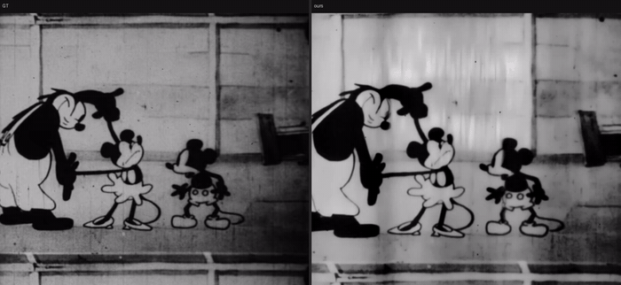
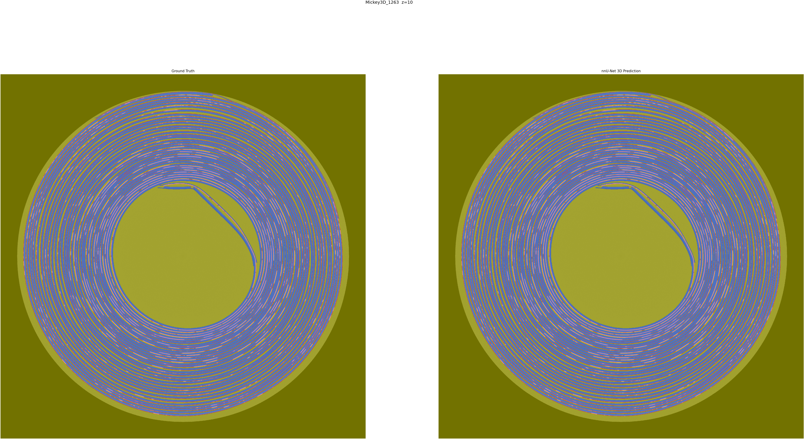
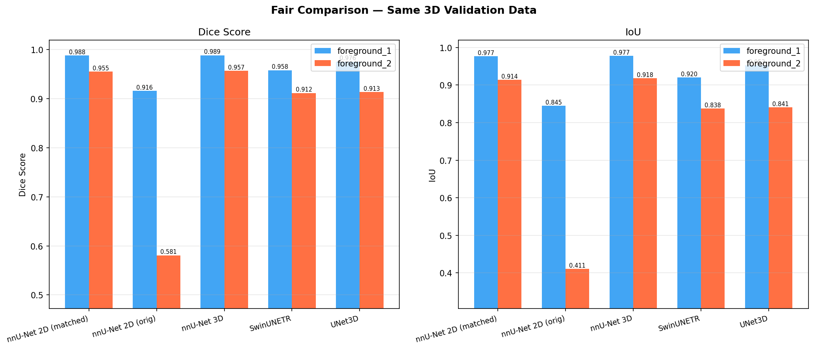
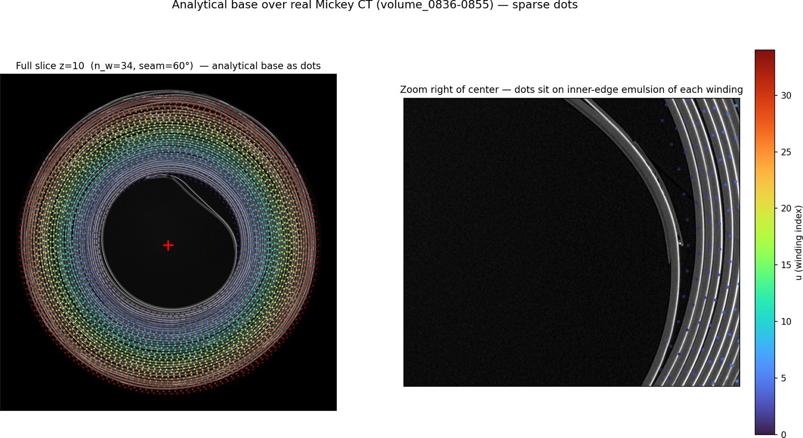
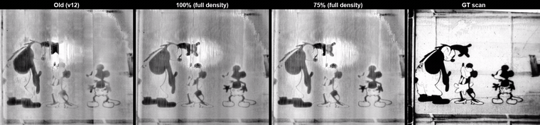

# Virtual Unrolling of Historical Movie Rolls

A two-stage computer vision pipeline that reconstructs playable film footage from **X-ray CT scans of tightly wound, physically inaccessible movie reels** — without ever unspooling them. Built at the [Paul Scherrer Institute (PSI)](https://www.psi.ch/) on a real 1930s Mickey Mouse reel scanned at ~3700×3700 px per cross-section.

The CT scan shows the film spool end-on: dozens of concentric layers of base + emulsion, wound ~34 times around a spool. The goal is to trace every winding through the 3D volume and unroll it into a flat strip — recovering the original frames.

```
CT cross-section  →  3D semantic segmentation  →  per-winding geometry tracing  →  unrolled strip  →  frames
```

<p align="center">
  
</p>

<p align="center"><em>Final result: real optical scan (left) vs. frames reconstructed purely from CT geometry, after de-shading + denoising (right) — the reconstruction was never shown the ground truth.</em></p>

---

## Pipeline

### 1. Segmentation
Each CT cross-section is segmented into 3 classes — background, film base, emulsion — as the geometric foundation for tracing individual windings. Five architectures (2D/3D nnU-Net, 3D UNet, SwinUNETR) were trained and compared under identical data splits.

| Model | Dice | IoU |
|-------|------|-----|
| **nnU-Net 3D** | **0.973** | **0.948** |
| nnU-Net 2D (matched) | 0.972 | 0.945 |
| UNet3D | 0.945 | 0.897 |
| SwinUNETR | 0.935 | 0.879 |
| nnU-Net 2D (original) | 0.749 | 0.628 |

<p align="center">
  
  <br><sub>nnU-Net 3D prediction (right) vs. ground truth (left) on a held-out cross-section.</sub>
</p>
<p align="center">
  
</p>

### 2. Winding geometry — the emulsion walk
Simply counting rings radially fails wherever the emulsion layer is faint or dashed (which happens throughout the roll). Instead, each winding is traced by **walking along the emulsion band itself**, slice by slice:

- A raycast detector seeds an approximate radius per winding at a sparse set of z-anchors.
- From each seed, the walk follows the local emulsion centerline outward in azimuth, re-centering on the segmented band at every step — so it self-corrects instead of drifting.
- A z-consistency pass (profile tracking + outlier healing) catches windings that jump onto a neighboring layer mid-turn.
- Columns are cut at uniform **arc length** along the film rather than uniform angle, which removes the periodic "breathing" distortion that a naive polar unrolling introduces.

<p align="center">
  
  <br><sub>Per-winding geometry (colored by winding index) traced directly on the raw CT cross-section.</sub>
</p>

The result: all ~34 windings recovered with zero fabricated/interpolated geometry, unrolled into a single continuous strip hundreds of thousands of pixels long, then cut into individual frames.

### 3. Validation against ground truth
The same physical reel also exists as a conventional optical scan, which makes this one of the few settings where a CT-based reconstruction can be checked frame-by-frame against real footage. Frames are matched to the optical scan via cell-quantized dynamic programming and scored with a modality-robust metric suite (structural/gradient correlation, MS-SSIM, LPIPS/DISTS) rather than pixel MSE — plain PSNR turned out to be a misleading metric here, penalizing sharp line-art edges and small shading drift far out of proportion to actual visual quality.

| Metric | Value |
|---|---|
| Grad-correlation | 0.788 |
| MS-SSIM | 0.857 |
| SSIM | 0.776 |
| LPIPS ↓ | 0.143 |
| DISTS ↓ | 0.125 |

<p align="center">
  
  <br><sub>Pipeline iteration, each checked against the same GT frame: an earlier geometry version, two densities of the current emulsion-walk, and the real scan.</sub>
</p>

### 4. Post-processing
The geometry-only strip still carries a broad brightness/shading field from the unrolling and CT/emulsion grain. A final restoration pass removes both: geometry-aware, content-masked de-shading, then a pretrained temporal video denoiser (FastDVDnet, zero-shot) for grain. This de-shaded + denoised video is the final result shown at the top of this README.

### Synthetic data generator
Since real ground-truth 3D geometry doesn't exist, a synthetic generator rolls arbitrary 2D footage into a CT-realistic spiral (physically motivated intensity model, configurable eccentricity/jitter/noise) to benchmark unwrapping methods against known geometry before applying them to the real scan.

---

## Project structure

```
Scripts/                        # Segmentation training/eval + data conversion utilities
  train_nnunet.py, train_monai.py, predict_monai.py, fair_compare.py
  convert_3d_data.py, create_2d_from_3d.py, export_seg_slices.py, ...
  slurm/                        # HPC (SLURM) job scripts for the pipeline stages above
unwrapping/
  synthetic/generate.py         # CT-realistic spiral-roll data generator
  inr/                          # Winding geometry + rendering
    walk_emulsion.py            # Emulsion-band walk (per-winding tracing)
    unroll_walk_wholeroll_v13.py  # Whole-roll assembly, arc-length columns
    winding_raycast.py          # Winding-count seeding
    surface_*.py, *_model.py    # INR-based residual mapping (synthetic benchmark track)
    make_film_video.py          # Strip -> playable video
  eval/                         # Ground-truth frame matching, stabilization, metrics
    frame_match.py, stabilize_affine.py, compare_videos.py, metrics.py
video_restoration/               # De-shading + denoising post-processing
docs/images/, docs/media/        # Figures used in this README
```

---

## Setup

```bash
conda create -n thesis python=3.12 -y
conda activate thesis
pip install torch torchvision torchaudio --index-url https://download.pytorch.org/whl/cu124
pip install -r requirements.txt
```

Segmentation training and the full-resolution unwrapping pipeline were run on an HPC cluster with A100 80GB GPUs; equivalent compute is expected for full retraining or a from-scratch re-walk of the real scan.
