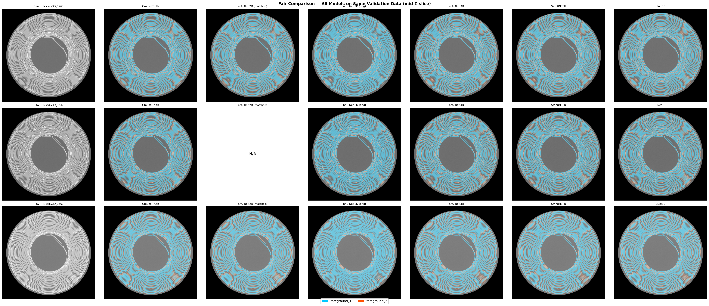

# Virtual Unrolling of Movie Rolls
Project at [Paul Scherrer Institute (PSI)](https://www.psi.ch/) investigating deep learning segmentation methods for high-quality tomography scans of historical movie rolls.

The project can be roughly split into 2 steps: Segmentation and INR modelling.
The segmentation step identifies the film layers within CT cross-sections, a prerequisite for virtual unrolling. We compare multiple 2D and 3D architectures under fair, controlled conditions.

---

## Models

Five model configurations are trained and evaluated on the same data splits:

| Model | Framework | Type | Dataset | Patch Size |
|-------|-----------|------|---------|------------|
| **nnU-Net 2D** | nnU-Net v2 | 2D | Dataset501 (50 TIF) | auto-configured |
| **nnU-Net 2D (matched)** | nnU-Net v2 | 2D | Dataset503 (500 slices from 3D) | auto-configured |
| **nnU-Net 3D** | nnU-Net v2 | 3D | Dataset502 (25 NIfTI volumes) | auto-configured |
| **UNet3D** | MONAI | 3D | Dataset502 | 16 x 256 x 256 |
| **SwinUNETR** | MONAI | 3D | Dataset502 | 32 x 256 x 256 |

All models segment 3 classes: background, foreground_1 (film base), and foreground_2 (emulsion layer).

---

## Results

All models evaluated on the same 5 hold-out 3D volumes (fold 0, ~3063 x 3062 x 20 voxels each).

| Model | Dice | IoU | Precision | Recall |
|-------|------|-----|-----------|--------|
| **nnU-Net 3D** | **0.9728** | **0.9475** | 0.9718 | 0.9738 |
| nnU-Net 2D (matched) | 0.9717 | 0.9454 | 0.9725 | 0.9709 |
| UNet3D | 0.9447 | 0.8969 | 0.9428 | 0.9467 |
| SwinUNETR | 0.9350 | 0.8788 | 0.9243 | 0.9459 |
| nnU-Net 2D (orig) | 0.7485 | 0.6280 | 0.9234 | 0.6809 |




### nnU-Net 3D — Ground Truth vs Prediction

Side-by-side comparison at full resolution (case Mickey3D_1263, z=10). Yellow = background, blue = foreground_1, red = foreground_2.


## Datasets

| ID | Name | Description |
|----|------|-------------|
| 501 | Dataset501_MickeyScroll | 50 independent 2D TIF images converted from HDF5 |
| 502 | Dataset502_MickeyScroll3D | 25 3D NIfTI volumes (~20 slices each, 3063 x 3062 XY) |
| 503 | Dataset503_MickeyScroll2Dfrom3D | 500 2D TIF slices extracted from Dataset502 |

Dataset503 enables fair 2D vs 3D comparison by ensuring the 2D model sees slices from the same volumes as the 3D models.

---

## Project Structure

```
Scripts/
  train_nnunet.py           # nnU-Net 2D training (HDF5 -> TIF + training)
  train_monai.py            # MONAI training (UNet3D, SwinUNETR)
  predict_monai.py          # MONAI inference
  fair_compare.py           # Fair comparison across all models
  compare_results.py        # Result aggregation and plots
  convert_3d_data.py        # HDF5 -> NIfTI conversion (Dataset502)
  create_2d_from_3d.py      # Dataset502 -> Dataset503
  custom_trainer.py         # nnUNetTrainerProgress (250 epochs, tqdm)
  visualize.py              # 2D prediction visualization
  visualize_nnunet3d.py     # 3D prediction visualization (high-quality)
  slurm/                    # SLURM job scripts (Merlin7 A100)
  setup/                    # One-time HPC setup scripts + guide
```

---

## Setup

### Local (Windows)

```bash
conda create -n nnunet python=3.12 -y
conda activate nnunet
pip install torch torchvision torchaudio --index-url https://download.pytorch.org/whl/cu124
pip install -r requirements.txt
```

### HPC
```
The models in this project were trained on an HPC cluster with A100 80GB GPUs. Equivalent computing power is expected for complete retraining.

---

